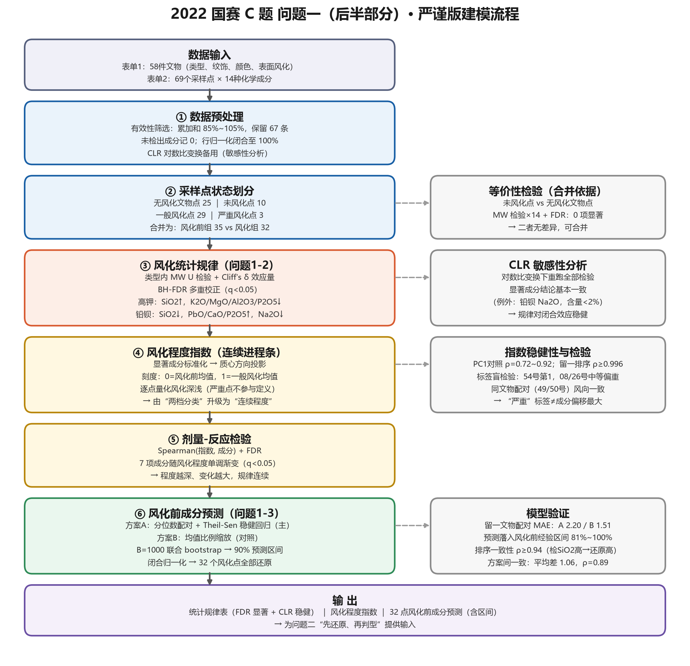
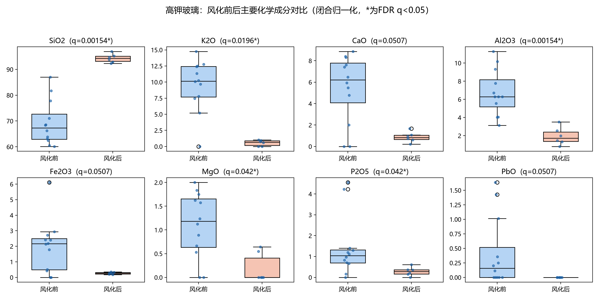
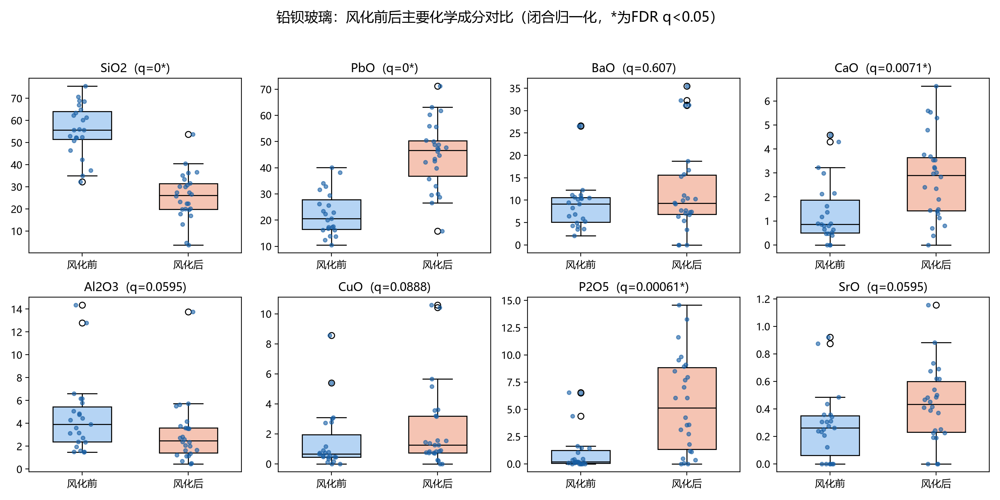
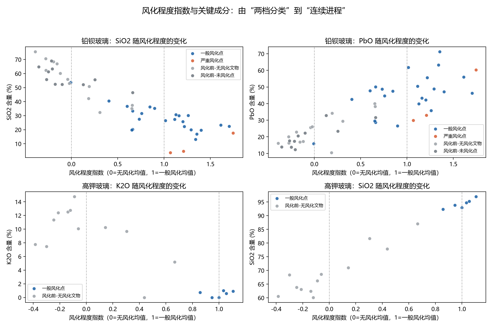
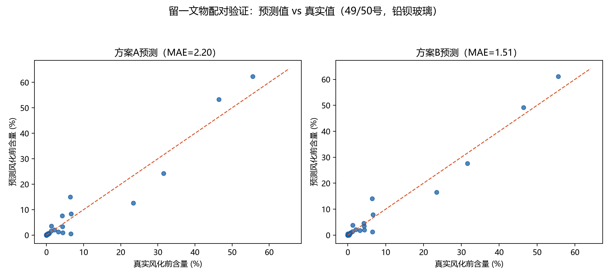

# 古代玻璃制品的风化统计规律与风化前成分还原

**——2022 年高教社杯全国大学生数学建模竞赛 C 题问题一（后半部分）专项论文**

> **范围说明**：本文仅针对问题一的后半部分展开，即（i）结合玻璃类型，分析文物表面有无风化的化学成分统计规律；（ii）依据风化点的检测数据，预测其风化前的化学成分含量。问题一前半部分（风化与类型、纹饰、颜色的关联分析）与本问题（二至四问）的内容不在本文范围内，仅在必要时作定性衔接。

## 摘要

针对古代玻璃制品"表面有无风化"与"风化前成分还原"两个问题，本文以附件表单 2 的 69 条采样点数据（经有效性筛选保留 67 条）为基础，建立了"闭合归一化—非参数检验—连续风化指数—稳健分布映射还原"的完整建模流程。

**在统计规律层面**，为消除检测总量漂移的影响，先将 14 种成分闭合归一化至 100%；再对每种玻璃类型的各成分做 Mann-Whitney U 检验，辅以 Cliff's δ 效应量刻画变化幅度，并做 Benjamini-Hochberg FDR 多重校正；另以 CLR 对数比变换做成分数据敏感性分析。结果表明：高钾玻璃风化的实质是 K2O、MgO、Al2O3、P2O5 等可溶组分大量流失（K2O 下降 94.3%），难溶的 SiO2 占比被动抬高（上升 36.3%）；铅钡玻璃风化的实质是富硅骨架溶解流失与环境磷、钙渗入，SiO2 下降 53.9%，PbO、P2O5、CaO 占比分别上升 98.8%、398.9%、108.8%。两类玻璃风化方向截然相反，显著成分经 FDR 校正（q<0.05）与 CLR 敏感性验证后依然稳健。

**在风化程度层面**，将"有/无风化"的二值标签升级为连续型风化程度指数：以显著成分的风化前组标准化得分构造风化方向向量，取样本投影作为指数，并经 PC1 对照、留一排序稳定性、噪声地板三重稳健性检查；标签盲检验发现"严重风化点"标签反映取样部位（风化层），与成分偏移幅度相关但不等价；Spearman 剂量-反应检验表明主要显著成分沿风化程度单调渐变，统计规律由"两档对比"升级为"剂量-反应"关系。

**在成分还原层面**，建立两个预测模型：模型一（主模型）在同类型内对风化前组与风化组做分位数配对，以 Theil-Sen 稳健回归拟合各成分的分布映射，预测后闭合归一化，并用 B=1000 次联合 bootstrap 给出与闭合约束自洽的 90% 预测区间；模型二（对照）采用均值比例缩放法。以 49、50 号同时含风化点与未风化点的文物做留一配对验证，两模型平均绝对误差分别为 2.20 与 1.51 个百分点；预测值落入同类型风化前经验区间的比例为 81%–100%，检出 SiO2 与还原 SiO2 的排序一致性达 ρ≥0.94，两方案预测平均仅差 1.06 个百分点，交叉印证了结果可信。最后讨论了小样本、极端风化点与个体差异带来的不确定性。

**关键词**：闭合归一化；Mann-Whitney U 检验；Cliff's δ；FDR 校正；CLR 对数比变换；风化程度指数；Theil-Sen 稳健回归；bootstrap 预测区间

## 1 问题重述

高钾玻璃与铅钡玻璃是两类典型中国古代玻璃体系，长期埋藏后表面会发生不同程度的风化，导致化学成分比例改变。题目给出三类数据：表单 1（58 件文物的类型、纹饰、颜色、表面风化信息）、表单 2（69 条采样点的 14 种化学成分检测记录，标注未风化点/严重风化点）、表单 3（8 件待鉴别文物的成分数据）。

本文研究问题一的后半部分：

1. **统计规律**：结合玻璃类型，分析文物表面有无风化与其化学成分含量之间的统计规律；
2. **成分还原**：依据风化点的检测数据，预测其风化前的化学成分含量。

## 2 问题分析

问题一后半部分需要回答两个层层递进的子问题。**第一子问题**是组间比较：对每种玻璃类型，比较风化样本与未风化样本在 14 种成分上的分布差异。由于样本量小（高钾玻璃有效 18 条、铅钡 49 条）、成分数据天然受"总和约束"（各成分之和须为 100%）、且多重比较会放大假阳性，直接做逐成分 t 检验既不稳健也不完整。为此需要：先做闭合归一化消除总量漂移；再采用不依赖正态假定的非参数检验，并同步报告效应量与 FDR 校正结果；最后用成分数据专用的 CLR 变换做敏感性分析，确认结论不是闭合效应的伪像。

**第二子问题**是回归预测：对 32 个风化采样点（高钾 6、铅钡 26）还原其风化前成分。风化前状态的数据来自无风化文物与风化文物上的未风化点，两类点能否合并为"风化前"参照组需要先做等价性检验。建模的核心困难在于：风化点与风化前点并非一一配对观测，只能利用"同类型内成分分布"的信息建立映射。本文的思路是：若风化在类型内具有相对稳定的成分变化模式，则同类型内风化点与风化前点在各自经验分布中的相对位置（分位数）应当对应，据此构造分位数配对并做稳健回归；同时以不依赖配对假设的均值比例缩放法作对照。预测的不确定性用联合 bootstrap 区间显式刻画，模型的可靠性用留一文物配对验证、经验区间覆盖与排序一致性检验。

总体技术路线如图 1。

**图 1　问题一后半部分总体技术路线**

## 3 模型假设

1. 附件检测数据真实可靠；按题设，14 种成分累加和处于 [85%, 105%] 的记录视为有效，越界记录剔除；
2. 检测值空白表示该成分未检测到（低于检出限），记为 0，不做删行或插补；
3. 同类型玻璃的成分空间相近，风化引起的成分变化在同类型内具有稳定映射规律；
4. 风化点与风化前点在各自经验分布中的相对位置（分位数）相互对应；
5. 风化文物上标注的"未风化点"与无风化文物的采样点总体同分布，可合并为"风化前"参照组（第 4 节经检验支持）;
6. "严重风化点"标签反映取样部位（取自风化层），其成分观测仍属于风化状态总体，不单独建组。

## 4 符号说明

| 符号 | 含义 |
|---|---|
| $x_{ij}$ | 第 $i$ 条记录第 $j$ 种成分的原始检测值（%） |
| $\tilde{x}_{ij}$ | 闭合归一化后的成分含量（%） |
| $z_{ij}$ | 第 $j$ 种成分按风化前组标准化后的得分 |
| $v$ | 风化方向向量（一般风化组与风化前组标准化均值之差） |
| $I_i$ | 第 $i$ 条记录的风化程度指数 |
| $p_k$ | 分位数配对所用的第 $k$ 个分位点 |
| $a_j, b_j$ | 第 $j$ 种成分 Theil-Sen 回归的截距与斜率 |
| $k_j$ | 模型二中第 $j$ 种成分的均值比例缩放系数 |
| $\delta$ | Cliff's δ 效应量（风化后相对风化前的方向） |
| $q$ | Benjamini-Hochberg FDR 校正后的 p 值 |
| $\rho$ | Spearman 秩相关系数 |

## 5 数据预处理

### 5.1 有效性筛选与缺失处理

表单 2 共 69 条采样记录。按题设，14 种成分累加和处于 [85%, 105%] 的记录视为有效，据此剔除 2 条越界记录，保留 **67 条有效数据**，其中高钾玻璃 18 条、铅钡玻璃 49 条。检测值空白表示未检测到该成分，按低于检出限记 0 处理，不做删行或插补，以保留小样本信息。

### 5.2 闭合归一化

成分检测值总和存在漂移（未严格等于 100%），直接用原始值比较会混入总量因素。将每条记录归一化至 100%：

$$\tilde{x}_{ij}=\frac{x_{ij}}{\sum_{k=1}^{14}x_{ik}}\times 100\%$$

后续所有统计分析均在 $\tilde{x}$ 上进行。

### 5.3 成分数据敏感性（CLR 变换）

百分比成分数据受闭合效应约束，任意一元的变动必然牵动其余。为确认第 6 节结论并非闭合效应的伪像，对零值以 0.005% 替代后做中心对数比（CLR）变换：

$$\mathrm{CLR}(x)_j=\ln\frac{x_j}{\left(\prod_{k=1}^{14}x_k\right)^{1/14}}$$

在 CLR 尺度下重跑全部组间检验作为敏感性分析（结果见 6.3）。

## 6 表面有无风化的化学成分统计规律

### 6.1 采样点状态划分与"风化前"参照组的合并检验

结合表单 1 的"表面风化"字段与表单 2 的采样点标注，将 67 条有效数据划入四种状态：

| 状态 | 判定规则 | 高钾 | 铅钡 |
|---|---|---|---|
| 风化前-无风化文物 | 无风化文物的采样点 | 12 | 13 |
| 风化前-未风化点 | 风化文物上标注"未风化点" | 0 | 10 |
| 一般风化点 | 风化文物的普通采样点 | 6 | 23 |
| 严重风化点 | 标注"严重风化点"（取自风化层） | 0 | 3 |

风化文物上的"未风化点"与无风化文物的采样点能否合并为"风化前"参照组，直接决定预测建模的样本量。对 14 种成分分别做 Mann-Whitney 检验并做 BH-FDR 校正，**无一成分 q<0.05**，未发现系统差异，支持将二者合并为"风化前"组。由此高钾玻璃风化前组共 12 条、铅钡玻璃 23 条。

### 6.2 检验方法

对每种玻璃类型、每种成分，比较"风化前组"与"风化后组"（含严重风化点）：

1. **Mann-Whitney U 检验**（双侧，α=0.05）：不依赖正态假定，适合小样本与偏态分布；
2. **Cliff's δ 效应量**：$\delta=1-2U/(n_1 n_2)$，δ>0 表示风化后普遍更高；|δ|<0.147 可忽略，<0.33 为小，<0.474 为中，否则为大；
3. **FDR 校正**：类型内 14 项检验做 Benjamini-Hochberg 校正，以 q<0.05 判显著，控制错误发现率；
4. **CLR 敏感性分析**：在 CLR 尺度下重跑全部检验，核对结论对成分变换的稳健性。

### 6.3 检验结果

高钾玻璃的显著成分见表 2，风化前后分布对比见图 2；铅钡玻璃的显著成分见表 3，分布对比见图 3。

**表 2　高钾玻璃风化前 vs 风化后显著成分（FDR 后，q<0.05）**

| 成分 | 风化前均值 | 风化后均值 | 相对变化 | Cliff's δ | FDR q |
|---|---|---|---|---|---|
| SiO2 | 65.71 | 93.44 | ↑ 36.3% | +1.000（大） | 0.0015 |
| Al2O3 | 6.63 | 1.91 | ↓ 71.2% | −0.972（大） | 0.0015 |
| K2O | 9.72 | 0.55 | ↓ 94.3% | −0.861（大） | 0.0196 |
| P2O5 | 1.44 | 0.28 | ↓ 80.3% | −0.736（大） | 0.0420 |
| MgO | 1.08 | 0.19 | ↓ 82.1% | −0.722（大） | 0.0420 |

**图 2　高钾玻璃风化前后主要成分分布箱线图（闭合归一化尺度）**

**表 3　铅钡玻璃风化前 vs 风化后显著成分（FDR 后，q<0.05）**

| 成分 | 风化前均值 | 风化后均值 | 相对变化 | Cliff's δ | FDR q |
|---|---|---|---|---|---|
| SiO2 | 55.44 | 24.19 | ↓ 53.9% | −0.933（大） | <0.0001 |
| PbO | 21.71 | 43.16 | ↑ 98.8% | +0.843（大） | <0.0001 |
| P2O5 | 1.05 | 5.24 | ↑ 398.9% | +0.639（大） | 0.0006 |
| CaO | 1.30 | 2.71 | ↑ 108.8% | +0.517（大） | 0.0071 |
| Na2O | 1.82 | 0.23 | ↓ 87.1% | −0.338（小） | 0.0324 |

**图 3　铅钡玻璃风化前后主要成分分布箱线图（闭合归一化尺度）**

**规律解读**：高钾玻璃（SiO2-K2O 体系）风化时，可溶性的钾、镁、铝、磷组分经水-土作用大量流失，难溶的二氧化硅骨架留存，占比被动抬高——这是"流失富集"型风化。铅钡玻璃（PbO-BaO-SiO2 体系）网络结构不稳定，风化时富硅骨架溶解流失，同时环境中的磷、钙渗入沉积，PbO、BaO 等难溶组分占比被动升高——这是"溶蚀渗入"型风化。**两类玻璃的风化方向截然相反**（高钾 SiO2 上升、铅钡 SiO2 下降），与二者助熔剂体系及网络结构的化学差异相符，也提示对风化点直接判型会产生系统偏差，必须先"还原"再判别，这为问题二的方法设计提供了依据。

**稳健性**：10 项显著成分中 9 项在 CLR 变换下保持显著，唯一例外是铅钡 Na2O（含量低于 2%，零值替代敏感）；其余结论差异均出现在原本不显著的边缘成分。上述显著规律对成分变换的选择稳健。

## 7 风化程度指数：从"有/无"到"连续进程"

### 7.1 指数构造

"有/无风化"的二分标签丢失了程度信息。仅用第 6 节中 FDR 显著、且在风化前组非退化的成分（高钾：SiO2、K2O、MgO、Al2O3、P2O5；铅钡：SiO2、Na2O、CaO、PbO、P2O5），构造连续型风化程度指数：

1. 各成分按风化前组标准化：$z_{ij}=(\tilde{x}_{ij}-\mu_j)/s_j$；
2. 定义**风化方向**（严重风化点不参与定义，避免极端值主导）：

$$v=\bar{z}^{\text{一般风化}}-\bar{z}^{\text{风化前}}$$

3. 指数取样本在风化方向上的投影：

$$I_i=\frac{z_i^{\top}v}{v^{\top}v}$$

刻度含义：I=0 为风化前组平均水平，I=1 为一般风化组平均水平，I 越大风化越深。

### 7.2 稳健性检查

**表 4　风化程度指数的三重稳健性检查**

| 检查 | 高钾 | 铅钡 | 结论 |
|---|---|---|---|
| PC1 对照指数与原指数的 Spearman ρ | 0.915 | 0.718 | 指数不依赖方向定义的具体选择 |
| 留一重建方向后排序稳定性（最小 ρ） | 1.000 | 0.996 | 排序对单点剔除高度稳定 |
| 风化前组噪声地板 \|I\| 的 95% 分位 vs 风化组离散度 | 0.540 vs 0.080 | 0.656 vs 0.400 | 风化信号整体高于噪声地板 |

三项检查表明：指数的排序不因方向定义方法（统计方向 vs 主成分方向）或个别样本的增删而改变；除高钾风化组内部离散度偏小（见第 10 节局限）外，风化信号整体高于风化前组的自然波动（噪声地板）。

### 7.3 标签盲检验与剂量-反应关系

**标签盲检验**：3 个严重风化点的标签未参与指数建模，将其作为"盲样"投回铅钡 26 个风化点中检验：54 号排第 1（I=1.744，成分偏移远超所有一般风化点）；08 号排第 10（I=1.209）、26 号排第 15（I=1.068），高于均值但未达极端。说明**"严重风化点"标签反映取样部位（风化层），与成分偏移幅度相关但不等价**——判断风化深浅应以成分连续测度为准，而非依赖部位标签。

**剂量-反应检验**：对风化点（含严重）做 Spearman(I, 成分) 并 FDR 校正，单调趋势显著的成分——高钾：SiO2（ρ=0.943）、Al2O3（ρ=−1.000）；铅钡：SiO2（ρ=−0.627）、P2O5（ρ=0.630）、CaO（ρ=0.602）、Na2O（ρ=−0.470）、PbO（ρ=0.463），均 q<0.05。即第 6 节的规律不仅"组间有差"，而且沿风化程度**单调渐变**，统计规律由"两档对比"升级为"剂量-反应"关系。

**同文物配对佐证**：49 号文物风化点 I=1.248 对其未风化点 0.237，50 号 1.326 对 0.646——同一器物内部成分沿风化方向一致移动。50 号未风化点指数偏高（0.646）提示其已偏离"原始状态"，这与后文其预测验证误差偏大相一致。

各采样点风化程度指数及严重风化点盲检验位置见图 4。

**图 4　各采样点风化程度指数轨迹（按指数排序，标注严重风化点盲检验位置）**

## 8 风化前化学成分含量预测

### 8.1 模型一（主模型）：分位数配对 + Theil-Sen 稳健回归 + bootstrap 区间

**建模思想**：风化点与风化前点没有逐点配对观测，但若假设 3、4 成立，则同类型内两组经验分布的同一分位点描述的是"同一种成分禀赋"在风化前后的表现，可以通过分位数配对学习风化引起的映射。

**映射构造**：对每种成分 $j$，将风化前组与风化组的经验分布取同一组分位点 $p_k=(k-0.5)/K$，其中 $K=\max(m,n,20)$，$m,n$ 为两组样本量，构造配对 $(x_{(p_k)}, y_{(p_k)})$。考虑到分位数配对在小样本下可能产生异常配对点，采用 **Theil-Sen 稳健回归**（全部配对点斜率的中位数）拟合线性映射：

$$\hat{y}_j=a_j+b_j x_j$$

以中位数斜率替代最小二乘，可避免个别异常分位数对拟合的主导。各成分独立预测后按闭合性重新归一化至 100%，预测值裁剪至 [0,100]；风化后几乎恒为 0 的退化成分回退保持原值。

**预测区间**：对"风化组、风化前组"分别重抽样 B=1000 次，每次全流程重建映射、预测并**先闭合归一化再统计分位数**，得到每个采样点每种成分的 90% 区间。区间在每次重抽样中先满足闭合约束再取分位数，因而与点预测的闭合归一化自洽。

### 8.2 模型二（对照）：均值比例缩放法

不依赖任何配对假设，直接以风化前组与风化组的均值之比作为缩放系数：

$$k_j=\bar{y}_j^{\text{pre}}/\bar{x}_j^{\text{wth}},\qquad \hat{y}_j=k_j x_j$$

基准含量 ≤0.3% 的成分取 $k_j=1$（避免小分母放大噪声），预测后同样闭合归一化。该模型相当于"平均意义"上的还原，用作主模型的对照。

### 8.3 检验与结果

**（1）留一文物配对验证**。49、50 号铅钡文物同时具有风化点与"未风化点"，是天然的验证样本。验证时将该文物的全部采样点从训练数据中剔除（防信息泄漏），用其余数据建模，由其风化点反推风化前成分，再与真实未风化点逐成分对比：

**表 5　留一文物配对验证结果（MAE，百分点）**

| 验证对象 | 模型一（Theil-Sen） | 模型二（比例缩放） |
|---|---|---|
| 49 号 | 2.07 | 1.39 |
| 50 号 | 2.33 | 1.64 |
| **平均** | **2.20** | **1.51** |

两模型的平均绝对误差均不超过 2.5 个百分点，在 14 种成分、含量跨度 0–90%+ 的尺度上具有实用精度。50 号误差大于 49 号，与其未风化点本身指数偏高（0.646，已偏离原始状态）一致——验证"真值"本身含有位移，故表 5 的 MAE 是还原精度的保守上界。

**（2）合理性检查**。

- **经验区间覆盖**：关键成分（SiO2、PbO、BaO、K2O、CaO、P2O5）的预测值落入同类型风化前经验区间 [min, max] 的比例为 81%–100%，未出现超出历史波动范围的"幻觉值"；
- **排序一致性**：风化后检出 SiO2 越高（风化越轻）→ 还原出的风化前 SiO2 越高，高钾玻璃 ρ=0.943（p=0.005）、铅钡玻璃 ρ=0.979（p<10⁻⁴），还原结果保持了样本间的相对成分秩序；
- **方案间一致性**：两模型对全部 32 个风化点 14 种成分的预测平均绝对差仅 1.06 个百分点（Spearman ρ=0.890），两条独立路径给出一致的还原结果，交叉印证。

32 个风化采样点的还原明细（含各成分 90% bootstrap 区间）见附件 `03_风化前预测明细_含bootstrap区间.xlsx`，还原前后成分对比与验证散点见图 5。

**图 5　留一验证散点与还原结果示例**

## 9 结果汇总

综合以上建模，本文对问题一后半部分给出三层结论：

1. **统计规律**（第 6 节）：高钾玻璃风化的实质是 K2O（−94.3%）、MgO（−82.1%）、Al2O3（−71.2%）、P2O5（−80.3%）等可溶组分流失、SiO2 占比被动抬高（+36.3%）；铅钡玻璃风化的实质是硅骨架溶解流失与环境 P、Ca 渗入，SiO2 下降 53.9%，PbO（+98.8%）、P2O5（+398.9%）、CaO（+108.8%）显著升高。全部结论经 FDR 校正（q<0.05）与 CLR 敏感性验证，且两类玻璃风化方向相反。
2. **风化程度量化**（第 7 节）：连续风化程度指数（0=风化前均值，1=一般风化均值）经 PC1 对照、留一排序、噪声地板三重检查；"严重风化点"标签（取样部位）与成分偏移幅度相关但不等价；显著成分沿风化程度单调渐变（剂量-反应）。
3. **成分还原**（第 8 节）：主模型（分位数配对+Theil-Sen）与对照模型（均值比例缩放）对 32 个风化采样点完成风化前成分预测并给出 bootstrap 90% 区间；留一配对验证 MAE 分别为 2.20 与 1.51 个百分点，经验区间覆盖 81%–100%，排序一致性 ρ≥0.94，方案间平均差 1.06 个百分点。

## 10 模型评价与局限性

**优点**：

1. 全流程建立在闭合归一化尺度上，统计、指数、预测三个环节口径一致，bootstrap 区间与闭合约束自洽；
2. 组间比较"检验 + 效应量 + FDR + CLR 敏感性"四位一体，既回答"是否有差"，也回答"差多大""是否多重比较伪像"；
3. 风化程度指数把分类信息升级为连续进程，并以盲检验揭示"严重风化点"标签的部位属性，纠正了标签误读的可能；
4. 预测主模型以中位数斜率抗离群，验证协议（留一文物、经验区间、排序一致性、双方案互证）不依赖单一样本，结论可靠性有多重支撑。

**局限性**：

1. 高钾玻璃风化点仅 6 个且指数高度集中（σ=0.08），其规律与还原结果的不确定性大于铅钡玻璃；高钾风化前组存在个别高硅个体（如 03 部位 1，I=0.70），个体差异会抬高指数噪声地板；
2. 分位数配对假设"相对排序保持"，当风化剧烈改变成分排序时会产生偏差（54 号等极端点风险最高，其预测区间亦最宽）；
3. "未风化点"并非严格的风化前原始状态（不同部位、玻璃本体不均匀），50 号未风化点指数偏高即为例证；
4. 微量成分（SnO2、SO2 等）信息量不足，预测采用保守回退处理，其区间仅具参考意义；
5. 留一验证配对仅 2 件文物（49、50 号），模型间精度差异的统计分辨能力有限。

## 11 结论

本文针对 2022 年 C 题问题一的后半部分，建立了"闭合归一化—非参数检验—连续风化指数—稳健分布映射还原"的完整流程。研究表明：高钾玻璃与铅钡玻璃的风化化学机制方向相反，前者表现为可溶组分流失、SiO2 相对富集，后者表现为硅骨架流失与磷、钙渗入、铅钡氧化物占比被动升高；风化程度可用连续指数量化，且主要成分沿程度单调渐变；在此规律基础上，分位数配对+Theil-Sen 主模型能以约 2 个百分点以内的平均误差将风化点还原至风化前状态，并为问题二的"先还原、再判别/分亚类"路线提供了可直接使用的数据基础（`05_预测宽表_方案A.xlsx`）。

## 参考文献

[1] Aitchison J. The Statistical Analysis of Compositional Data[M]. London: Chapman and Hall, 1986.

[2] Mann H B, Whitney D R. On a test of whether one of two random variables is stochastically larger than the other[J]. The Annals of Mathematical Statistics, 1947, 18(1): 50-60.

[3] Benjamini Y, Hochberg Y. Controlling the false discovery rate: a practical and powerful approach to multiple testing[J]. Journal of the Royal Statistical Society: Series B, 1995, 57(1): 289-300.

[4] Cliff N. Dominance statistics: Ordinal analyses to answer ordinal questions[J]. Psychological Bulletin, 1993, 114(3): 494-509.

[5] Sen P K. Estimates of the regression coefficient based on Kendall's tau[J]. Journal of the American Statistical Association, 1968, 63(324): 1379-1389.

[6] Efron B, Tibshirani R J. An Introduction to the Bootstrap[M]. New York: Chapman & Hall, 1993.

## 附录 A　附件与复现说明

本论文全部结果由 `08_严谨版完整流程.py` 一键复现（依赖 pandas、scipy、matplotlib、openpyxl，随机种子 2022），数据源为 `附件.xlsx`。产出文件清单：

| 文件 | 内容 |
|---|---|
| 严谨版/01_清洗合并后数据.xlsx | 清洗、状态标注、闭合归一化与 CLR 后的 67 条有效数据 |
| 严谨版/02_统计规律与检验.xlsx | MW + Cliff's δ + FDR + CLR 敏感性全表 |
| 严谨版/02b_未风化点等价性检验.xlsx | 未风化点 vs 无风化文物点合并依据 |
| 严谨版/03_风化前预测明细_含bootstrap区间.xlsx | 每个风化点×每种成分：检测值、双模型预测、90% 区间 |
| 严谨版/04_模型参数_方案A.xlsx | 各成分 Theil-Sen 系数与 R² |
| 严谨版/05_预测宽表_方案A.xlsx | 每个风化点还原后的完整 14 成分（主模型） |
| 严谨版/05b_预测宽表_方案B.xlsx | 每个风化点还原后的完整 14 成分（对照模型） |
| 严谨版/06_留一配对验证.xlsx | 49、50 号留一验证明细 |
| 严谨版/07_合理性检查_经验区间.xlsx | 关键成分经验区间覆盖比例 |
| 严谨版/07b_排序一致性.xlsx | 检出/还原排序一致性 |
| 严谨版/08_风化程度指数.xlsx | 指数明细、严重风化点盲检验、剂量-反应、同文物配对 |
| 严谨版/图/*.png | 论文图 1–5 |
| 09_流程图.py | 图 1 技术路线图绘制脚本 |
| 建模说明_严谨版.md | 建模过程技术说明 |
