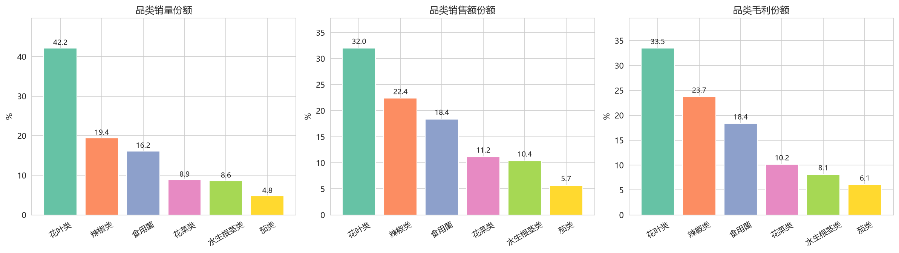
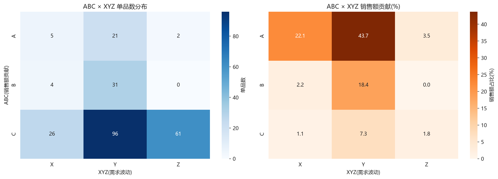
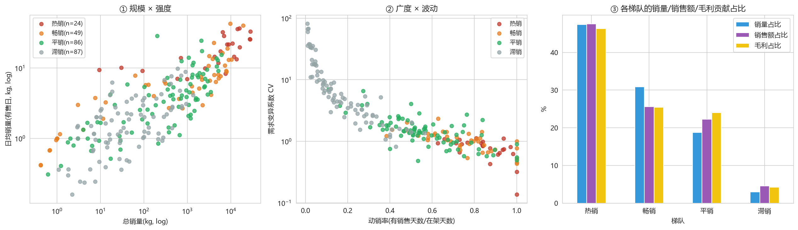
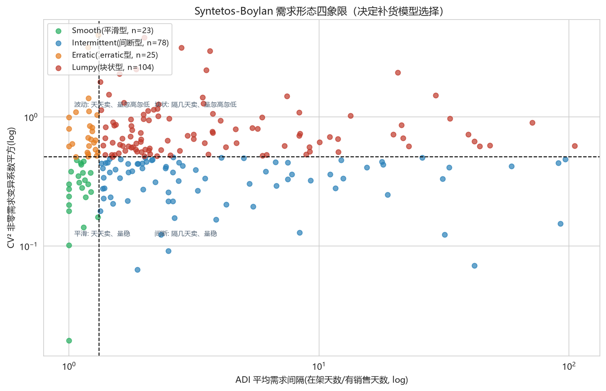
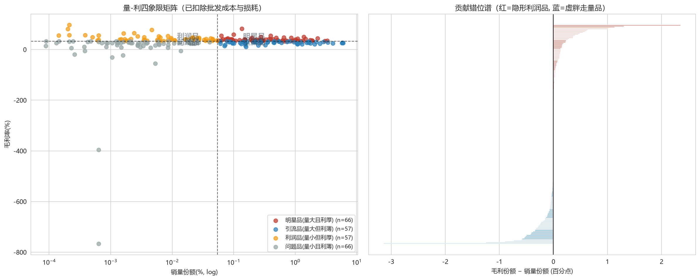
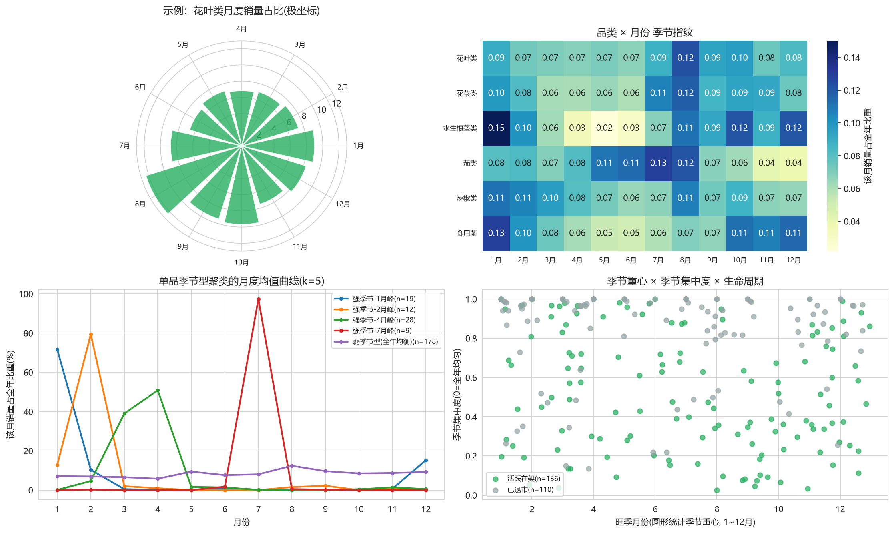
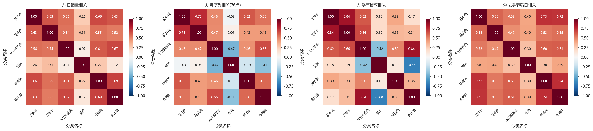
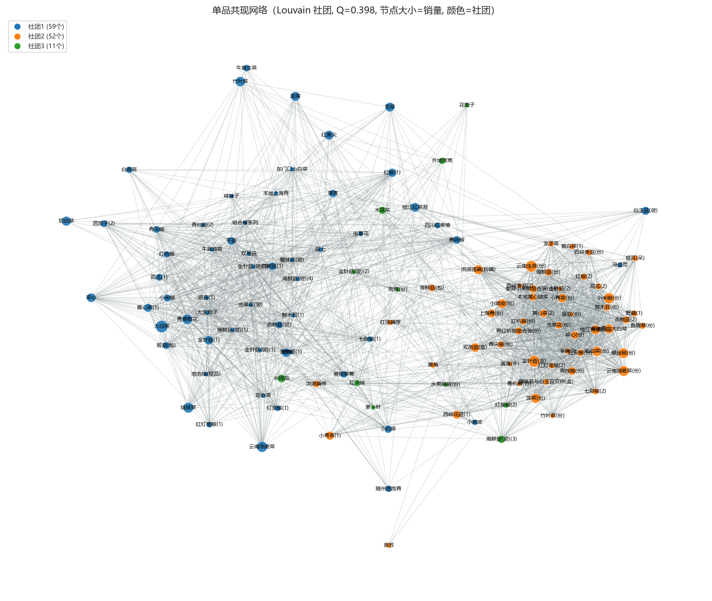
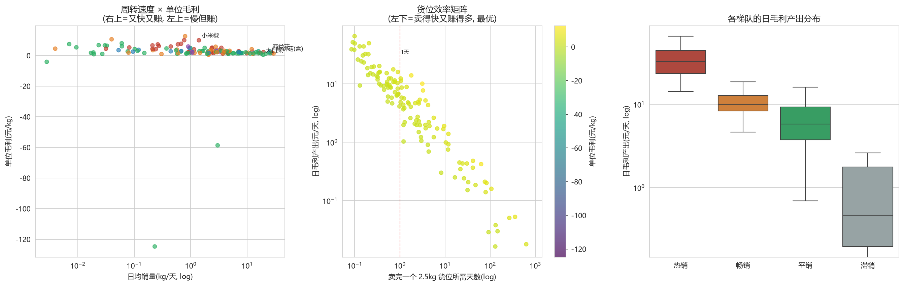

# 2023 年 C 题问题 1 分析报告：蔬菜单品的分布规律与相互关系

本文分析附件数据中蔬菜单品的销售分布规律与品类、单品间的相互关系。数据为附件 2 的销售流水，时间跨度 2020 年 7 月 1 日至 2023 年 6 月 30 日，共 1,095 天，清洗剔除退货与异常记录后剩 878,503 条流水，251 个单品中 246 个有实际销售，归并为 6 个品类。全部数值由 code/ 目录下 00、04、05 三个脚本的输出核对得出，图见 figs/，明细数据见 results/。

## 1 数据口径与成本修正

批发价记录来自附件 3，共 55,982 条，覆盖全部 251 个单品，按天对齐成 1,095 天乘 251 单品的面板后缺失 218,863 格，缺失率 79.6%。本小组用单品批发价中位数配合前后向填充补齐面板，补齐后流水与批发价的匹配率 100.00%。没有采用删除缺失期的做法，批发价在月内变动很小，删掉 79.6% 的日期会同时删掉大半个销售样本，损失远大于填充误差。

成本口径本文做了修正，单位有效成本按式 (1) 计算：

$$C = \frac{P}{1-r} \quad (1)$$

式中 P 为批发价，r 为附件 4 中该单品的损耗率。这样处理的账很直接：每售出 1 kg 陈列品，进货端要准备 1/(1-r) kg，品类平均损耗率 7.12%~14.14% 对应成本被低估 7.7%~16.5%，直接拿批发价当成本会把毛利率整体抬高。修正后 246 个单品的毛利率中位数为 33.1%，单位毛利中位数 2.246 元/kg，单位毛利为负的单品 8 个。

## 2 品类的量价本利结构

花叶类 99 个单品占销量 42.15%，是门店的基本盘，销售额占比 32.02%，用销售额占比除以销量占比得到相对价格指数 0.76，为六品类最低；花菜类该指数 1.26 最高。六品类结构见表 1。

表 1 六品类的量价本利结构

| 品类 | 单品数 | 销量占比/% | 销售额占比/% | 毛利占比/% | 整体毛利率/% | 平均损耗率/% |
|---|---|---|---|---|---|---|
| 花叶类 | 99 | 42.15 | 32.02 | 33.51 | 31.18 | 10.28 |
| 辣椒类 | 43 | 19.45 | 22.38 | 23.74 | 31.60 | 8.49 |
| 食用菌 | 71 | 16.16 | 18.39 | 18.37 | 29.77 | 8.08 |
| 花菜类 | 5 | 8.87 | 11.15 | 10.16 | 27.16 | 14.14 |
| 水生根茎类 | 18 | 8.62 | 10.39 | 8.14 | 23.34 | 11.79 |
| 茄类 | 10 | 4.76 | 5.67 | 6.08 | 31.95 | 7.12 |

价格最低的品类并不最不赚钱，这一条和直觉相反。花叶类毛利率 31.18%，与茄类的 31.95%、辣椒类的 31.60% 同处第一梯队，高于花菜类的 27.16% 与水生根茎类的 23.34%。本文用毛利占比减销售额占比度量这种错位，花叶类 +1.49 个百分点，辣椒类 +1.36 个百分点，水生根茎类 -2.25 个百分点，见图 1。错位的原因在成本与损耗：花叶类损耗率 10.28%，明显低于花菜类的 14.14% 与水生根茎类的 11.79%，低价换来高周转与低损耗。单品层面差距更大，小米椒的单位毛利 9.99 元/kg，大白菜 0.49 元/kg，相差 20.5 倍；亏损最深的是洪山菜薹莲藕拼装礼盒，单位毛利 -124.73 元/kg。

图 1 六品类销量、销售额、毛利三者占比的错位

## 3 ABC-XYZ 九宫格分层

ABC 按销售额累计占比 70%、90%、100% 切分，得 A 类 28 个、B 类 35 个、C 类 183 个单品，销售额占比分别为 69.27%、20.54%、10.19%。波动维度本文没有用日粒度变异系数：日 CV 中位数 1.470，被大量零销售日严重膨胀，按它分层几乎全部单品都会落进高波动档。改为按周聚合后 CV 中位数降到 0.691，以 0.5 与 1.0 为界得 X 类 35 个、Y 类 148 个、Z 类 63 个，三类动销率均值分别为 0.583、0.430、0.594。两维交叉得到九宫格：AX 5 个、AY 21 个、AZ 2 个、BX 4 个、BY 31 个、BZ 0 个、CX 26 个、CY 96 个、CZ 61 个。

九宫格把策略集中到了少数格子。AX 与 AY 合计 26 个单品贡献 65.79% 的销售额，是必须保供的核心，前者可签长期供货协议做定量补货，后者要提高安全库存动态补货；A 类中只有 2 个单品波动剧烈，需要柔性补货；CZ 的 61 个单品合计只贡献 1.77% 销售额，属于末位淘汰与旺季临时上架的对象。图 2 给出九宫格与各格的策略映射。

图 2 ABC-XYZ 二维分层矩阵与单元格策略

## 4 熵权-TOPSIS 四梯队

本小组最初的方案是对总销量、单日最大销量、日均销量等特征做 KMeans 聚类，试算后发现三个特征高度共线，簇边界实际由规模一维决定，且簇心读不出业务含义，故放弃聚类路线。改为四个分工明确的维度：规模用总销量，广度用动销率即有售天数占比，强度用有售日日均销量，稳定用 1/CV。相关矩阵显示规模与强度相关 0.807，广度与稳定相关 0.796，两组高相关分别来自销量水平与销售覆盖两个侧面，保留它们是为了把卖得多与常年有售分开计分。权重由熵权法按信息量分配：广度 0.2928 最高，稳定 0.2581 次之，强度 0.2403，规模 0.2089 最低。

TOPSIS 得分按 10%、20%、35%、35% 分位切成热销、畅销、平销、滞销四梯队，画像见表 2。

表 2 四梯队画像

| 梯队 | 单品数 | 销量占比/% | 销售额占比/% | 毛利占比/% | 动销率均值 | 有售日日均销量/kg | TOPSIS 均值 |
|---|---|---|---|---|---|---|---|
| 热销 | 24 | 47.42 | 47.54 | 46.35 | 0.853 | 18.67 | 0.715 |
| 畅销 | 49 | 30.86 | 25.64 | 25.42 | 0.788 | 7.76 | 0.598 |
| 平销 | 86 | 18.79 | 22.25 | 23.98 | 0.554 | 5.03 | 0.480 |
| 滞销 | 87 | 2.93 | 4.57 | 4.25 | 0.170 | 2.20 | 0.239 |

分层没有退化成按销量排队。TOPSIS 得分与总销量的 Spearman ρ 为 0.527（p<0.0001），相关但不重合；与动销率的 ρ 为 0.884，覆盖天数与稳定性在排名中占了实打实的分量。热销梯队只占单品数的 9.8%，却贡献 47.42% 销量与 46.35% 毛利，头部代表西兰花得分 0.806、净藕(1) 0.781、芜湖青椒(1) 0.763。滞销梯队 87 个单品的 CV 均值高达 12.05，动销率均值 0.170。图 3 给出四梯队的四维画像与贡献对比。

图 3 四梯队的规模、强度、广度、波动与贡献对比

## 5 需求形态分类

梯队回答的是给多少货架与库存，形态回答的是用什么预测与补货模型，两件事分开处理。本文采用 Syntetos-Boylan 分类，以平均需求间隔 ADI=1.32 与需求变异系数平方 CV²=0.49 为界。246 个单品中 Smooth 34 个占 13.8%，Intermittent 83 个占 33.7%，Erratic 25 个占 10.2%，Lumpy 104 个占 42.3%。

形态与梯队交叉后有清晰的对应。Lumpy 104 个里 49 个落在滞销梯队、42 个在平销；Smooth 34 个里 27 个在热销或畅销，滞销里一个没有。品类间的差异更值得留意：茄类 10 个单品 8 个是 Lumpy，与它夏季集中上市的特征一致；花菜类 5 个单品中 2 个 Smooth、3 个 Intermittent，没有 Lumpy，是最适合标准补货模型的品类。形态到模型的映射为：Smooth 用指数平滑加 ROP 定量补货，Intermittent 用 Croston 法或 SBA，Erratic 提高安全库存，Lumpy 少备勤补、滞销时降价清货。图 4 给出四象限分布。

图 4 Syntetos-Boylan 需求形态四象限

## 6 量-利四象限

四象限的分界线选过两版。先按总销量与总毛利的中位数切分，得到 116 与 116 各半的结果，总销量与总毛利高度同源，切分退化；改成销量份额与毛利率双轴后，以中位数 0.055% 与 33.15% 为界，得到明星品 66 个、引流品 57 个、利润品 57 个、问题品 66 个。

明星品贡献销量 39.62%、毛利 39.22%，毛利率均值 39.64%，是量利双主力。引流品贡献销量 59.22% 但毛利率只有 26.54%，芜湖青椒(1)、西兰花、净藕(1) 都在其中，职能是带动客流。利润品销量占比仅 0.76% 而毛利率均值 44.71%；问题品两项垫底。错位分析找出了一批隐形利润品：西峡香菇(1) 销量份额 2.53%、毛利份额 4.89%；小米椒销量份额 0.31%、毛利份额 1.44%；组合椒系列毛利率 81.93%。反例是大白菜，销量份额 4.07% 只换来毛利份额 0.93%，毛利率 24.18%，是典型的引流品。图 5 为四象限矩阵。

图 5 量-利四象限矩阵与代表单品

## 7 季节指纹与生命周期

月份是环形的，12 月与 1 月相邻，直接对月份序号加权平均会把首尾两个月算到年中，因此季节重心按圆周统计，把 12 个月映射到圆周后求加权角度。结果为水生根茎类重心 11.2 月、食用菌 12.0 月、辣椒类 1.6 月，三者是冬菜；茄类重心 6.1 月，是唯一的夏菜。旺淡倍数按旺季月销量占比除以淡季月销量占比计算：水生根茎类 6.87 最大，茄类 3.37 次之，食用菌 2.51，辣椒类 1.72 最小。花叶类与辣椒类的一阶圆傅里叶幅度偏小，原因是两者在 1 月与 8 月各有峰，两峰相互抵消，重心月份会失真，需要配合旺淡倍数一起读。

对单品月度销量占比曲线做 k-means，k 取 3、4、5 三档试算：k=3 会把冬季峰并进一个簇，k=4 时 31 个冬季峰单品仍混在一团，k=5 才把 1 月峰 19 个与 2 月峰 12 个分开，簇内曲线峰值一致，故取 5。结果是弱季节型 178 个、占全部销量 97.7%；强季节型合计 68 个、销量占比 2.4%，其中 4 月峰 28 个且花叶类占 18，属春菜，另有 1 月峰 19 个、2 月峰 12 个、7 月峰 9 个。总量季节性弱于单品印象，这一点与第 8 节的归因结论呼应。

生命周期按近 6 个月是否有销售划分：已退市 110 个，占销量 10.2%，在架天数均值 183 天；活跃在架 136 个，占销量 89.8%，在架天数均值 654 天。各品类活跃单品数为花叶类 58、辣椒类 28、食用菌 29、水生根茎类 12、茄类 6、花菜类 3。问题 3 的选品候选池只从 136 个活跃单品里取，已退市单品无法补货，放进候选池没有决策意义。图 6 汇总季节指纹与生命周期。

图 6 季节指纹聚类与生命周期状态

## 8 品类相关性的归因分解

15 个品类对的日相关系数里，水生根茎类与茄类只有 0.074，茄类与食用菌 0.120，茄类与花叶类 0.257，初步看茄类接近需求独立。本文没有直接接受这个结论，把日相关拆成三个候选来源做归因：月度共同波动、季节指纹相似、日内真实联动。

两项检验支持第一种来源占主导。日相关对月序列相关做回归，r=0.981（p<0.0001），品类对的日相关几乎完全由月度层面的共同波动决定；日相关对季节指纹相似的 r=0.822（p=0.0002）。归因实验是去季节，把每日销量除以本品类月度季节指数再算相关。15 个品类对的平均相关从 0.473 升到 0.523，茄类与食用菌从 0.120 升到 0.393，水生根茎类与茄类从 0.074 升到 0.303，花叶类与茄类从 0.257 升到 0.398，见图 7。

机理在季节相位。茄类旺季 7 月占其销量 12.9%，淡季 12 月只有 3.8%；冬菜旺季在 12 月至次年 1 月。夏菜与冬菜的销量曲线接近反相，季节项贡献了负相关，把同一天里真实的日内联动盖住了，去季节后恢复的 0.30~0.40 就是被盖住的部分。据此本文修正初步判断：茄类并非需求独立，为问题 2 建品类联合补货模型时应保留品类联动项，同时显式引入各品类的季节相位。

图 7 品类相关性的三层归因：日相关、月序列相关与季节指纹相似

## 9 共现网络、互信息与替代关系

共现强度用 lift 而不用支持度，支持度反映单品自身热度，热门单品与任何单品共现都偏高；lift 以共现天数除以独立时的期望共现，剔除了热度本身。流水二值化后 246 个单品在 1,085 天内的整体购买率 0.175，共现天数范围 0~1,076 天。保留出现不少于 60 天的 132 个单品，以共现不少于 40 天且 lift 不低于 1.35 建边，得到 122 个节点、1,990 条边的网络。Louvain 社区发现给出 3 个社团，模块度 Q=0.3983，高于 0.3 的经验显著线，见图 8。三个社团规模 59、52、11 个单品，主导品类都是花叶类，分别 24、16、4 个，但每个社团横跨 4~6 个品类：社团 1 的代表单品为田七、荸荠、大龙茄子、金针菇(1)，社团 2 的代表为青杭椒(份)、龙牙菜、上海青(份)、菜心(份)。共现结构由购物篮的组合方式决定，与品类归属关系不大，做关联陈列时按社团取品比按品类取品更有效。

图 8 单品共现网络与 Louvain 社团

Pearson 相关只度量销量数值的线性共变，本文补充归一化互信息 NMI=MI/√(H(A)H(B))，度量两单品是否在同一天出现。Top40 单品上 NMI 与 Pearson 的 Spearman ρ 为 -0.016（p=0.66），两者近乎正交，回答的是两个不同的问题。两个方向的案例都有：净藕(1) 与茼蒿 Pearson 高达 0.529，NMI 只有 0.003，是同季供应造成的伪相关；云南油麦菜与云南油麦菜(份) Pearson 为 -0.440，NMI 却有 0.406，这种同日出现而此消彼长的依赖线性方法会漏掉。

替代关系在同款不同包装内部最清晰。36 组同款不同包装的对子里 lift<1 的有 23 组，共售日条件相关为负的有 19 组，直接证据是两者倾向于不同时出现在同一天。散装与份装互斥：云南生菜单装对份装 lift 0.452、全样本相关 -0.836，小米椒 lift 0.255，奶白菜 0.338，菜心 0.388。菌菇的盒装与袋装之间正好相反：杏鲍菇(1) 对杏鲍菇(袋) 共现 297 天、lift 2.180，金针菇(1) 对金针菇(袋)(1) lift 2.402，海鲜菇(2) 对海鲜菇(袋)(3) lift 4.521。两类包装关系完全不同，前者是同一批客人二选一，后者面向不同采购用途、经常一起买。定价上的含义是散装与份装要拉开价差避免左右互搏，菌菇不同包装可做组合促销。

## 10 货位效率与选品建议

评价一个单品值不值得占货位，本文用日毛利产出，定义为单位毛利乘以在架日销量，另设卖完一货位天数等于 2.5 除以日均销量，对应题目问题 3 的最小陈列 2.5 kg。单位毛利排序会误导：小米椒单位毛利 9.99 元/kg，日均只卖 1.40 kg，日毛利产出 13.95 元/天；大白菜单位毛利 0.49 元/kg，日均 19.17 kg，日毛利产出 9.36 元/天。单位毛利差 20.5 倍，同一块 2.5 kg 货位的日毛利产出只差 1.5 倍，这笔账是算得清的。

候选池 136 个单品中，日毛利产出前五为西兰花 65.56 元/天、芜湖青椒(1) 51.57 元/天、西峡香菇(1) 49.71 元/天、净藕(1) 49.25 元/天、小米椒(份) 43.79 元/天；垫底的是洪山菜薹珍品手提袋 -176.00 元/天与洪山菜薹莲藕拼装礼盒 -28.79 元/天，这两个亏损品每在架一天都在净亏。分梯队看，热销 34.12、平销 6.15、畅销 4.12、滞销 1.16 元/天，畅销反而低于平销，原因是畅销梯队里有洪山菜薹两个深亏品拉低了均值，梯队标签不能替代效率核算。

以日毛利产出为主序贪心选取 30 个单品并强制覆盖 6 品类，得到推荐池：花叶类 11 个、辣椒类 7 个、食用菌 6 个、花菜类 2 个、水生根茎类 2 个、茄类 2 个；梯队构成热销 18、畅销 6、平销 6；需求形态 Smooth 5、Erratic 10、Intermittent 7、Lumpy 8。该池覆盖门店总销量的 60.6% 与总毛利的 63.3%，池内卖完一货位最慢的是小米椒，也只要 1.79 天，可直接作为问题 3 的初始解。图 9 汇总货位效率与选品结果。

图 9 货位效率排序与 30 单品推荐池构成

## 11 结论

1. 分布高度长尾。28 个 A 类单品占单品数 11.4%，贡献销售额 69.27%；183 个 C 类单品贡献 10.19%；24 个热销单品贡献 47.42% 销量与 46.35% 毛利。
2. 均价低不等于不赚钱。花叶类相对价格指数 0.76 为六品类最低，毛利率 31.18% 仍居第一梯队；大白菜以 4.07% 的销量份额只贡献 0.93% 的毛利份额，毛利由损耗率与周转共同决定。
3. 稳定比规模更稀缺。熵权法给广度的权重 0.2928 为四维最高；34 个 Smooth 单品动销率 0.942，是唯一适合标准预测补货模型的一批。
4. 季节相位决定品类关系的表象。茄类是唯一夏菜，重心 6.1 月、旺淡倍数 3.37，与三个冬菜的表面相关仅 0.074~0.257，去季节后恢复至 0.30~0.40，品类联动真实存在。
5. 共现结构由购物篮组合决定，与品类归属关系不大。1,990 条边的网络分成 3 个跨品类社团，模块度 0.3983，关联陈列应按社团取品。
6. 同款不同包装是两类生意。36 组对子里 23 组散装对份装 lift<1，为替代关系；菌菇盒装与袋装 lift 2.18~4.52，为互补关系，定价与促销策略应分开。
7. 货位按日毛利产出分配。30 单品推荐池覆盖销量 60.6%、毛利 63.3%，货位周转最慢 1.79 天；洪山菜薹两个亏损品日亏 28.79~176.00 元，应首先移出货位。

附注：本报告的数据分析与初稿撰写使用了 AI 工具辅助，本小组对全部数值逐项核对了脚本输出，并对口径做了复核。
